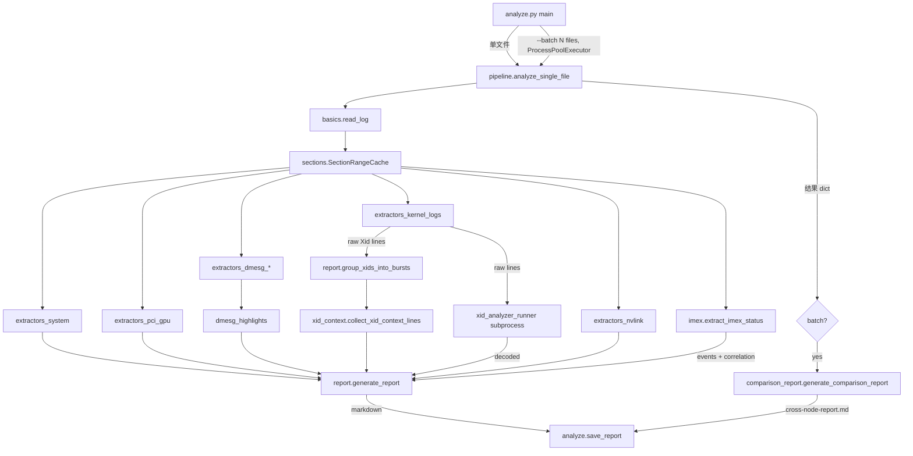

# analyze-nv-bug-report 脚本结构

本文档介绍 [`analyze-nv-bug-report/scripts/`](../analyze-nv-bug-report/scripts/) 下的代码组织：顶层入口 `analyze.py` 与 `nvbug_report/` 包内 19 个模块的职责划分。

## 顶层入口

### [`analyze.py`](../analyze-nv-bug-report/scripts/analyze.py) — CLI + 多进程编排

- 解析命令行：`<file.log>` 单文件模式 / `--batch <file...>` 批量模式 / `--output-dir DIR`
- 单文件：直接调 `analyze_single_file()` 然后写报告
- Batch：用 `concurrent.futures.ProcessPoolExecutor` 并行跑 N 个 worker
  - **Linux** 用 `fork` context（启动近乎 0 开销）
  - **macOS / Windows** 用平台默认 start method（Python 3.8+ 即 `spawn`，避免 Apple framework 非 fork-safe + CPython 3.14 在 Darwin deprecation 风险）
  - `max_workers = max(1, min(n_files, os.cpu_count()))`
- 所有 batch 结果再交给 `generate_comparison_report` 出 cross-node 对比报告
- 提供 `save_report()` 处理报告文件名（含父目录前缀防止跨节点重名）

整个文件不含业务逻辑，只是入口 + 进程池调度。

---

## `nvbug_report/` 包（19 个模块）

按职责分成 5 层。

### 一、基础设施层

| 文件 | 作用 |
|---|---|
| [`__init__.py`](../analyze-nv-bug-report/scripts/nvbug_report/__init__.py) | 包标记，无运行时逻辑 |
| [`constants.py`](../analyze-nv-bug-report/scripts/nvbug_report/constants.py) | 共享常量：C2C GPU 关键字（`GB200/GB300/VR200/VR300`）、`XID_PATTERN_QUICK` 正则 |
| [`timing.py`](../analyze-nv-bug-report/scripts/nvbug_report/timing.py) | `NV_BUG_REPORT_ANALYZE_TIMING=1` 启用的 stderr 阶段计时（`phase_start/phase_end/stat_line`） |
| [`basics.py`](../analyze-nv-bug-report/scripts/nvbug_report/basics.py) | 通用工具：`read_log` 读 `.log/.log.gz`、`parse_log_date`（含中文「年月日」）、`compute_boot_time`（Date − Uptime）、`normalize_bdf` 把短 BDF 补成 `0000:01:00.0` |
| [`syslog_ts.py`](../analyze-nv-bug-report/scripts/nvbug_report/syslog_ts.py) | syslog/dmesg 时间戳解析：中文月名归一化（按长度倒序避免「1月」误匹配「10月」）、syslog `Mar 12 19:50:49` + ISO 8601 `2026-04-03T06:20:28` 两种格式 |

### 二、区段定位层

| 文件 | 作用 |
|---|---|
| [`sections.py`](../analyze-nv-bug-report/scripts/nvbug_report/sections.py) | nv-bug-report 是 `____...____` 分隔的多区段文件。提供 `find_section_range(marker)` + **`SectionRangeCache` 记忆化**（关键性能优化，避免每个 extractor 各扫一遍 O(n)）；以及 `_get_dmesg_range`、`_get_syslog_ranges`（强制扫 4 个源：`Scanning kernel log files` / `journalctl -b -0:` / `journalctl -b -1:` / `/var/log/messages`） |

### 三、抽取器层（extractors）

按数据来源分文件，全部接收 `lines` + 可选 `cache`：

| 文件 | 作用 |
|---|---|
| [`extractors_system.py`](../analyze-nv-bug-report/scripts/nvbug_report/extractors_system.py) | 头部元数据（Date/uname/hostname/kernel/driver/CUDA/uptime）、dmidecode 系统 SN、`_supplement_system_info` 补缺 |
| [`extractors_pci_gpu.py`](../analyze-nv-bug-report/scripts/nvbug_report/extractors_pci_gpu.py) | `lspci -nn` 列 GPU、`lspci -nnDvvvxxxx` 详细字段、`nvidia-smi --query` 解析、`/proc/driver/nvidia/gpus/*/information` 兜底（dead GPU 时） |
| [`extractors_dmesg_nvrm.py`](../analyze-nv-bug-report/scripts/nvbug_report/extractors_dmesg_nvrm.py) | 从全文 NVRM 行里建立 BDF → GPU Board Serial Number 映射（pci 信息缺失时给 `extractors_pci_gpu` 补 SN） |
| [`extractors_dmesg_sections.py`](../analyze-nv-bug-report/scripts/nvbug_report/extractors_dmesg_sections.py) | 收集 dmesg/syslog 原始行（跨区段去重），扫 PCIe link drop / fallen off bus 等关键短语；定义 `_DMESG_MSG_NORMALIZE` 模板（被 `dmesg_highlights` 复用） |
| [`extractors_kernel_logs.py`](../analyze-nv-bug-report/scripts/nvbug_report/extractors_kernel_logs.py) | 核心 Xid 抽取：从 4 个 syslog 源 + dmesg 各自扫 `NVRM: Xid (PCI:...)`，跨源按 NVRM payload 去重；同时提供 `extract_message_start_time`、`extract_nvrm_errors`（非 Xid 的 NVRM 错误） |
| [`extractors_nvlink.py`](../analyze-nv-bug-report/scripts/nvbug_report/extractors_nvlink.py) | `nvidia-smi nvlink --errorcounters` 错误字段（过滤掉 traffic 统计）+ `--status` 链路状态 |

### 四、特殊领域 + 后处理层

| 文件 | 作用 |
|---|---|
| [`imex.py`](../analyze-nv-bug-report/scripts/nvbug_report/imex.py) | 解析 IMEX 服务状态、`nvidia-imex-ctl -N`、`/var/log/nvidia-imex.log` 中的 "Node disconnect event detected" ERROR；按 60s gap 分组成 events、用模式归一化去重；提供 `_find_related_imex_events`（按 ±60s 时间窗将 IMEX event 与 Xid burst 关联）、`_format_imex_related_line` |
| [`xid_context.py`](../analyze-nv-bug-report/scripts/nvbug_report/xid_context.py) | 围绕每个 Xid burst 的时间窗，从全文收集相关的非 Xid NVRM 行（"上下文行"），稍后嵌入到报告 §7.3 raw log 块 |
| [`xid_analyzer_runner.py`](../analyze-nv-bug-report/scripts/nvbug_report/xid_analyzer_runner.py) | 把 raw Xid 行写到临时文件，子进程跑 `third_party/nvidia_xid_analyzer.py --find-resolutions`，解析它的 psql 表格输出（多行单元格合并），返回结构化 `decoded_entries`（mnemonic / severity / HW-SW / resolution / ...）；优先用 `~/anaconda3/envs/nvparse/bin/python`，缺失则 fallback `sys.executable` |
| [`dmesg_highlights.py`](../analyze-nv-bug-report/scripts/nvbug_report/dmesg_highlights.py) | 把 dmesg/syslog 行分类成 `system_errors` / `other_warnings` 供报告 §7.5 用（boot 噪音用 `_DMESG_BOOT_WHITELIST` 过滤掉 ACPI/EFI/KASLR 这类正常启动信息） |

### 五、流水线 + 渲染层

| 文件 | 作用 |
|---|---|
| [`pipeline.py`](../analyze-nv-bug-report/scripts/nvbug_report/pipeline.py) | **`analyze_single_file(filepath)`** —— 上面所有 extractor 的串联编排：`read_log` → 建 `SectionRangeCache` → system / pci / gpu / xid / nvlink / imex 各 extractor → `group_xids_into_bursts` → `collect_xid_context_lines` → `extract_nvrm_errors`（排除已 Xid 关联的 payload）→ `run_xid_analyzer` → dmesg highlights → `generate_report`，每一步都打 timing。返回一个 dict 给上层用 |
| [`report.py`](../analyze-nv-bug-report/scripts/nvbug_report/report.py) | **单节点 Markdown 报告生成**（最大文件，约 40KB）：包含 `group_xids_into_bursts`（gap 分组）+ `generate_report`（System Overview / GPU Topology / NVLink / IMEX / Xid summary + decode + raw logs / dmesg highlights / Issues Summary 等所有章节渲染逻辑），含 IMEX 行间穿插进 Xid raw log 块的逻辑 |
| [`comparison_report.py`](../analyze-nv-bug-report/scripts/nvbug_report/comparison_report.py) | **多节点 cross-node 对比报告**（batch 模式专用）：File overview 表、IMEX node disconnect 时间线、Xid 比较矩阵（节点 × Xid 编号）、Xid 统一时间线（含 IMEX 关联）、Xid 解码摘要去重、IMEX-Xid Event Correlation 块 |

---

## 整体数据流

---

## 一句话总结

- **`analyze.py`** = 入口 + 进程调度
- **`pipeline.py`** = 单文件流水线编排（19 个模块的"指挥棒"）
- **`extractors_*.py`（6 个）** = 从 nv-bug-report 各区段抽数据
- **`imex.py` / `xid_context.py` / `xid_analyzer_runner.py` / `dmesg_highlights.py`** = 领域专用后处理
- **`report.py` / `comparison_report.py`** = 渲染 Markdown
- **`sections.py` / `basics.py` / `syslog_ts.py` / `constants.py` / `timing.py` / `__init__.py`** = 基础设施

---

## 平台支持

- **Linux** 与 **macOS** 均支持
- Batch 模式每个 log 在独立进程中分析（Linux 用 `fork`，macOS 用 `spawn`）—— 吞吐相同，macOS 上每个 worker 冷启动慢几百 ms（重新 import `nvbug_report.*`），相对几秒级单文件分析时间可忽略
